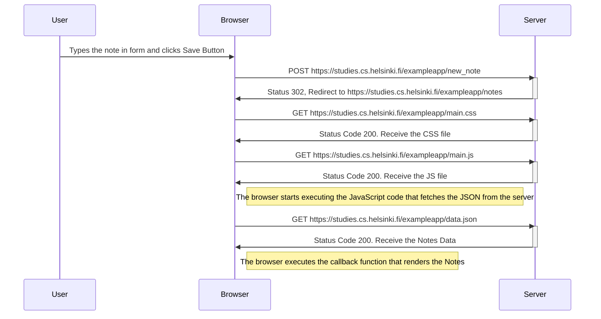

```mermaid
sequenceDiagram
    participant User
    participant Browser
    participant Server


    User->>Browser: Types the note in form and clicks Save Button
    Browser->>Server: POST https://studies.cs.helsinki.fi/exampleapp/new_note

    activate Server
    Server->>Browser: Status 302, Redirect to https://studies.cs.helsinki.fi/exampleapp/notes
    deactivate Server

    Browser->>Server: GET https://studies.cs.helsinki.fi/exampleapp/main.css

    activate Server
    Server->>Browser: Status Code 200. Receive the CSS file
    deactivate Server

    Browser->>Server: GET https://studies.cs.helsinki.fi/exampleapp/main.js

    activate Server
    Server->>Browser: Status Code 200. Receive the JS file
    deactivate Server

    Note right of Browser: The browser starts executing the JavaScript code that fetches the JSON from the server

    Browser->>Server: GET https://studies.cs.helsinki.fi/exampleapp/data.json

    activate Server
    Server->>Browser: Status Code 200. Receive the Notes Data
    deactivate Server

    Note right of Browser: The browser executes the callback function that renders the Notes
```
