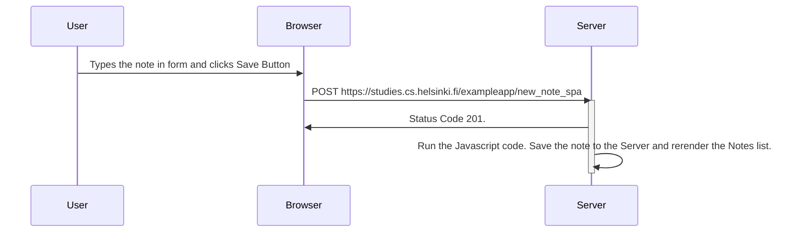

```mermaid
sequenceDiagram
    participant User
    participant Browser
    participant Server

    User->>Browser: Types the note in form and clicks Save Button
    Browser->>Server: POST https://studies.cs.helsinki.fi/exampleapp/new_note_spa

    activate Server
    Server->>Browser: Status Code 201.

    Server->>Server: Run the Javascript code. Save the note to the Server and rerender the Notes list.
    deactivate Server
```
